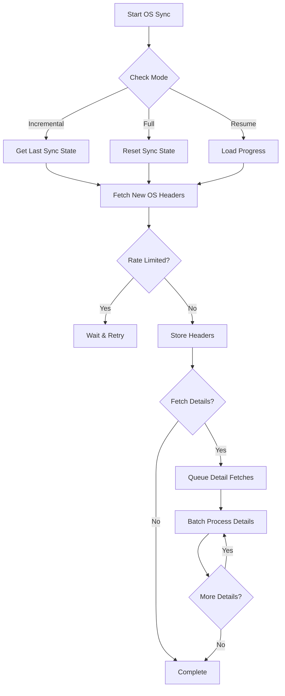

# OS Sync Redesign Plan

## Current Problems

1. **Full Sync Every Time**: Always syncs ALL data, even if we already have it
2. **Individual Detail Fetches**: Makes thousands of API calls (one per OS record)
3. **No Progress Tracking**: Can't resume if interrupted
4. **Poor Rate Limit Handling**: Hits limits too quickly
5. **No Incremental Sync**: Doesn't track what's new vs existing

## Proposed Solution Architecture

### 1. Incremental Sync Strategy

#### A. Track Sync State
```sql
CREATE TABLE os_sync_state (
  id INT PRIMARY KEY DEFAULT 1,
  last_sync_date DATE,
  last_sync_os_id INT,
  highest_os_id INT,
  total_synced INT,
  sync_status ENUM('idle', 'running', 'paused', 'failed'),
  last_error TEXT,
  created_at TIMESTAMP DEFAULT CURRENT_TIMESTAMP,
  updated_at TIMESTAMP DEFAULT CURRENT_TIMESTAMP ON UPDATE CURRENT_TIMESTAMP
);
```

#### B. Sync Only New/Updated Records
- First sync: Get highest OS ID in our database
- Subsequent syncs: Only fetch OS records with ID > highest_os_id
- Alternative: Use date filtering if API supports it

### 2. Smart Batching Strategy

#### A. Bulk Fetch Pattern
```
Phase 1: Fetch OS headers in large batches (500-1000 records)
  - /os?pagina=1&linhas=1000
  - Store basic data quickly
  - Track which OS IDs need detail fetch

Phase 2: Fetch details in controlled batches
  - Group 10-20 OS IDs
  - Make bulk detail request if API supports
  - Or fetch with heavy rate limiting
```

#### B. Progressive Sync
```
Day 1: Sync OS headers only (fast)
Day 2: Sync 20% of details
Day 3: Sync next 20% of details
...continuing until complete
```

### 3. Rate Limit Respect Strategy

#### A. Adaptive Delays
```typescript
interface RateLimitStrategy {
  baseDelay: number;        // Start with 1000ms
  maxDelay: number;         // Cap at 60000ms
  backoffMultiplier: number; // 2x on each 429
  successReduction: number;  // 0.9x on success
  
  // Track per endpoint
  endpoints: {
    '/os': { currentDelay: 1000, failures: 0 },
    '/os/:id': { currentDelay: 2000, failures: 0 }
  }
}
```

#### B. Request Budgeting
```typescript
interface RequestBudget {
  maxRequestsPerMinute: 30;  // Conservative
  maxRequestsPerHour: 1000;
  currentMinuteCount: 0;
  currentHourCount: 0;
  
  canMakeRequest(): boolean;
  waitTime(): number;
}
```

### 4. Implementation Changes

#### A. New OS Sync Service Structure
```typescript
class IncrementalOsSyncService {
  async sync(options: {
    mode: 'full' | 'incremental' | 'resume';
    fetchDetails: boolean;
    maxRecords?: number;
    dateFrom?: Date;
    dateTo?: Date;
  }): Promise<SyncResult>;
  
  async syncHeaders(): Promise<number>;
  async syncDetails(osIds: number[]): Promise<number>;
  async getUnsyncedOsIds(): Promise<number[]>;
  async updateSyncState(state: Partial<SyncState>): Promise<void>;
}
```

#### B. Monitor Integration
- Button 3: "OS Headers" - Quick sync of basic data
- Button 8: "OS Details" - Sync details for headers we have
- Show sync state in status panel
- Resume capability if interrupted

### 5. Sync Workflow



### 6. Database Schema Updates

```sql
-- Track individual OS sync status
ALTER TABLE os ADD COLUMN 
  details_synced BOOLEAN DEFAULT FALSE,
  sync_attempted_at TIMESTAMP NULL,
  sync_error TEXT NULL;

-- Index for efficient queries
CREATE INDEX idx_os_details_sync ON os(details_synced, codigo_os);
CREATE INDEX idx_os_sync_date ON os(data_abertura, codigo_os);
```

### 7. Configuration

```typescript
// config/osSync.config.ts
export const osSyncConfig = {
  headers: {
    batchSize: 1000,
    delayMs: 1000,
    maxRetries: 3
  },
  details: {
    batchSize: 10,
    delayMs: 5000,
    maxRetries: 5,
    maxConcurrent: 2
  },
  rateLimits: {
    requestsPerMinute: 30,
    requestsPerHour: 1000,
    backoffMultiplier: 2
  },
  incremental: {
    enabled: true,
    lookbackDays: 7, // Re-sync last 7 days
    maxRecordsPerRun: 5000
  }
};
```

### 8. Monitoring & Alerts

- Track sync progress in real-time
- Alert if sync is stuck for > 1 hour
- Show requests/minute rate
- Display queue size for pending details
- Estimate completion time

## Implementation Priority

1. **Phase 1**: Incremental sync for headers (1-2 days)
   - Add sync state tracking
   - Implement incremental fetch
   - Update monitor UI

2. **Phase 2**: Smart rate limiting (1 day)
   - Implement request budgeting
   - Add adaptive delays
   - Track per-endpoint limits

3. **Phase 3**: Batch detail fetching (2-3 days)
   - Queue system for details
   - Parallel processing with limits
   - Resume capability

4. **Phase 4**: Monitoring improvements (1 day)
   - Progress tracking UI
   - Sync analytics
   - Performance metrics

## Expected Outcomes

- **Sync Time**: 10,000 records in 30-60 minutes (vs current 5+ hours)
- **API Calls**: Reduced by 90% through batching
- **Rate Limits**: Rare occurrences with adaptive strategy
- **Reliability**: Can resume from any interruption
- **Efficiency**: Only sync new/changed data

## Next Steps

1. Review and approve this plan
2. Create feature branch for implementation
3. Start with Phase 1 (incremental sync)
4. Test with small batches first
5. Deploy with careful monitoring